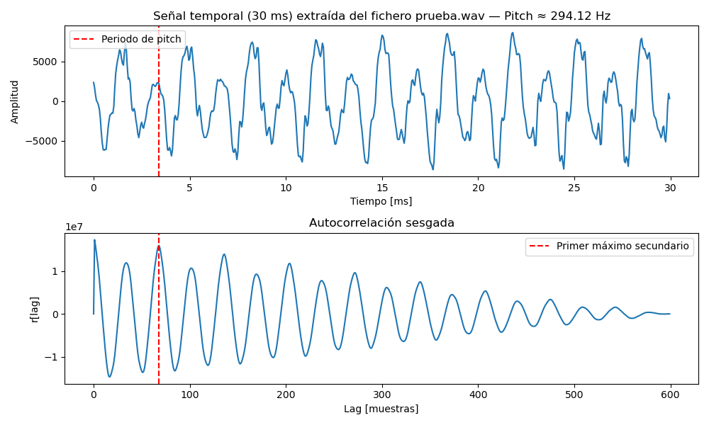
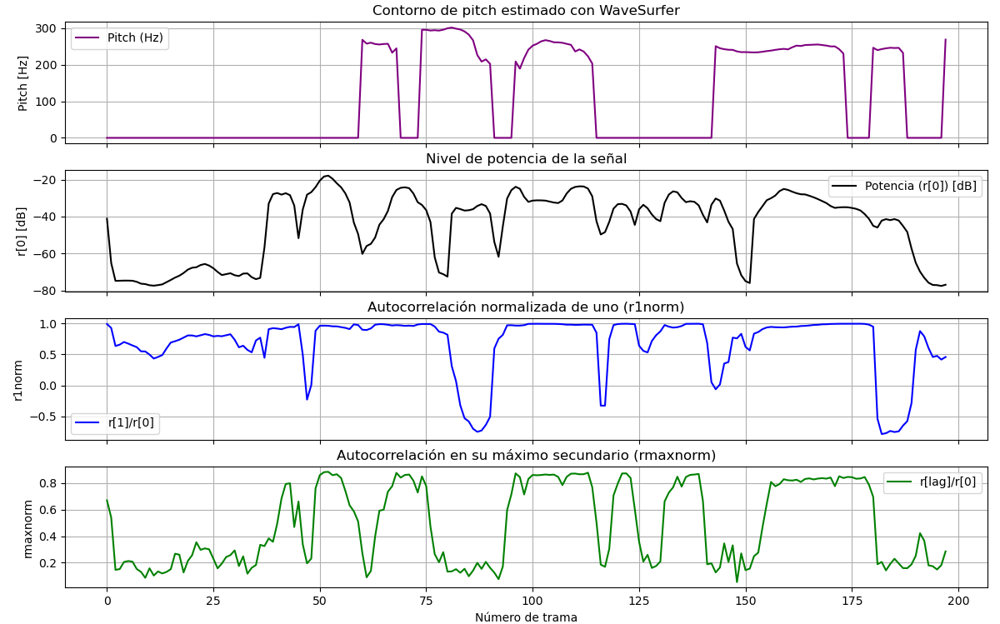
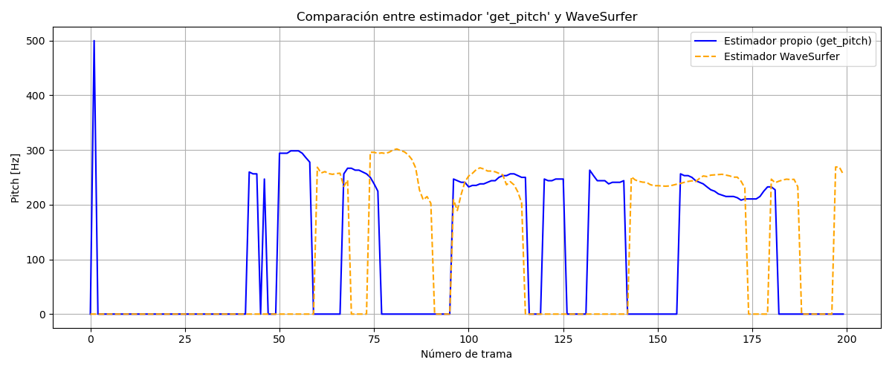
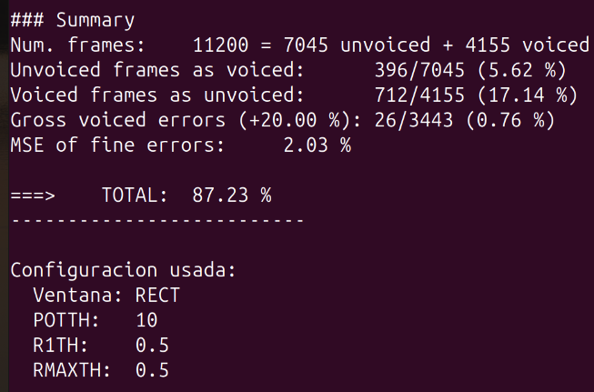
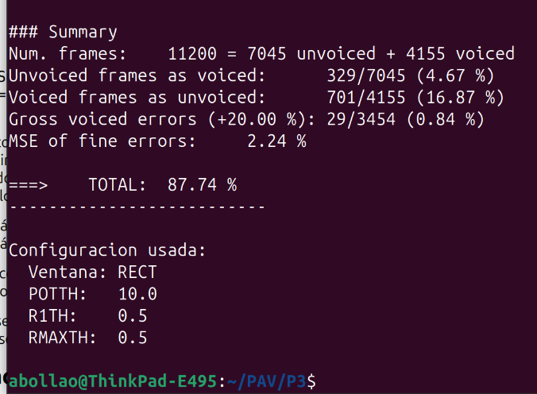
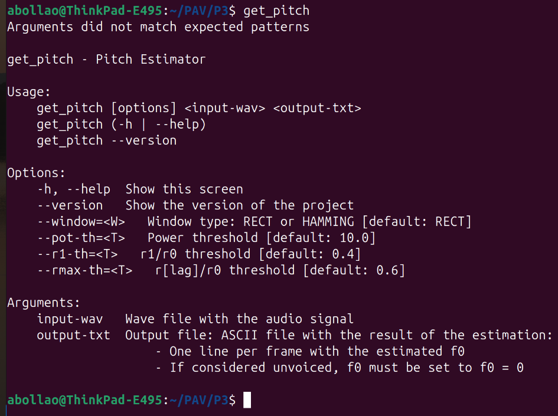
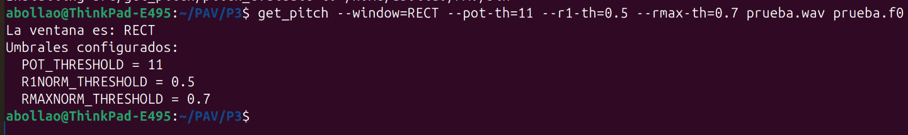
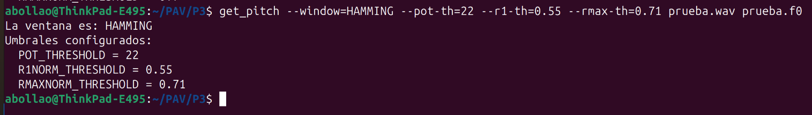
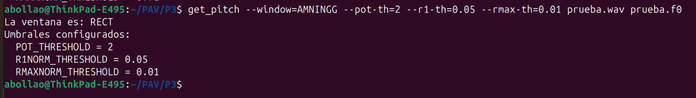

PAV - P3: estimación de pitch
=============================

Esta práctica se distribuye a través del repositorio GitHub [Práctica 3](https://github.com/albino-pav/P3).
Siga las instrucciones de la [Práctica 2](https://github.com/albino-pav/P2) para realizar un `fork` de la
misma y distribuir copias locales (*clones*) del mismo a los distintos integrantes del grupo de prácticas.

Recuerde realizar el *pull request* al repositorio original una vez completada la práctica.

Ejercicios básicos
------------------

- Complete el código de los ficheros necesarios para realizar la estimación de pitch usando el programa
  `get_pitch`.

   * Complete el cálculo de la autocorrelación e inserte a continuación el código correspondiente.
```cpp
  void PitchAnalyzer::autocorrelation(const vector<float> &x, vector<float> &r) const {
    /// \TODO Compute the autocorrelation r[l]
    /// \FET Hemos hecho la autocorrelacion sesgada

    
    unsigned int N = x.size();  // Número de muestras en la ventana
    
    for (unsigned int l = 0; l < r.size(); ++l) {
        float sum = 0.0F;
        
        for (unsigned int n = 0; n < N - l; ++n) {
            sum += x[n] * x[n + l];
        }
        
        r[l] = sum / (float)N;  // Dividimos por N para autocorrelación sesgada
    }

    if (r[0] == 0.0F) // Para evitar problemas con divisiones por cero o log()
        r[0] = 1e-10;
}
```

   * Inserte una gŕafica donde, en un *subplot*, se vea con claridad la señal temporal de un segmento de
     unos 30 ms de un fonema sonoro y su periodo de pitch; y, en otro *subplot*, se vea con claridad la
	 autocorrelación de la señal y la posición del primer máximo secundario.

**Respuesta:** Subplot generado con el script `subplot_sonoro.py` ubicado en la carpeta `src`.



	 NOTA: es más que probable que tenga que usar Python, Octave/MATLAB u otro programa semejante para
	 hacerlo. Se valorará la utilización de la biblioteca matplotlib de Python.

   * Determine el mejor candidato para el periodo de pitch localizando el primer máximo secundario de la
     autocorrelación. Inserte a continuación el código correspondiente.

```cpp
float PitchAnalyzer::compute_pitch(vector<float> & x) const {
    if (x.size() != frameLen)
      return -1.0F;

    //Window input frame
    for (unsigned int i=0; i<x.size(); ++i)
      x[i] *= window[i];

    vector<float> r(npitch_max);

    //Compute correlation
    autocorrelation(x, r);

    vector<float>::const_iterator iR = r.begin();

    /// \TODO 
	/// Find the lag of the maximum value of the autocorrelation away from the origin.<br>
	/// Choices to set the minimum value of the lag are:
	///    - The first negative value of the autocorrelation.
	///    - The lag corresponding to the maximum value of the pitch.
    ///	   .
	/// In either case, the lag should not exceed that of the minimum value of the pitch.
      /// \FET Hemos implementado la búsqueda del lag máximo usando iteradores
      vector<float>::const_iterator iRStart = r.begin() + npitch_min;
      vector<float>::const_iterator iREnd = r.end();
      
      vector<float>::const_iterator iRMax = max_element(iRStart, iREnd);

    unsigned int lag = iRMax - r.begin();

    float pot = 10 * log10(r[0]);

    //You can print these (and other) features, look at them using wavesurfer
    //Based on that, implement a rule for unvoiced
    //change to #if 1 and compile
#if 0
    if (r[0] > 0.0F)
      cout << pot << '\t' << r[1]/r[0] << '\t' << r[lag]/r[0] << endl;
#endif
    
    if (unvoiced(pot, r[1]/r[0], r[lag]/r[0]))
      return 0;
    else
      return (float) samplingFreq/(float) lag;
  }

  
}
```

   * Implemente la regla de decisión sonoro o sordo e inserte el código correspondiente.

```cpp
bool PitchAnalyzer::unvoiced(float pot, float r1norm, float rmaxnorm) const {
    /// \TODO Implement a rule to decide whether the sound is voiced or not.
    /// * You can use the standard features (pot, r1norm, rmaxnorm),
    ///   or compute and use other ones.
    /// \FET Hemos implementado un primer criterio simple de sonoro/sordo en unvoiced()
    /// Criterio basado en potencia (pot), autocorrelación en lag=1 (r1norm) y máximo (rmaxnorm)

    const float POT_THRESHOLD = 10.0F;     // Antes 20.0 -> ahora 10.0
    const float R1NORM_THRESHOLD = 0.4F;    // Antes 0.6 -> ahora 0.4
    const float RMAXNORM_THRESHOLD = 0.6F;  // Antes 0.8 -> ahora 0.6
    // Con los valores anteriores recibiamos un 0% de resultados

    // Criterio flexible:
    // - Si potencia baja -> probablemente sordo
    // - Si rmaxnorm bajo -> probablemente ruido
    // - Permitimos que r1norm sea más bajo que antes

    int passed = 0;

    if (pot > POT_THRESHOLD) passed++;
    if (r1norm > R1NORM_THRESHOLD) passed++;
    if (rmaxnorm > RMAXNORM_THRESHOLD) passed++;

    // Decisión:
    // Si al menos 2 de las 3 condiciones se cumplen → voiced (sonoro)
    // Si menos de 2 -> unvoiced (sordo)
    return (passed < 2);
}
```


   * Puede serle útil seguir las instrucciones contenidas en el documento adjunto `código.pdf`.

- Una vez completados los puntos anteriores, dispondrá de una primera versión del estimador de pitch. El 
  resto del trabajo consiste, básicamente, en obtener las mejores prestaciones posibles con él.

  * Utilice el programa `wavesurfer` para analizar las condiciones apropiadas para determinar si un
    segmento es sonoro o sordo. 
	
	  - Inserte una gráfica con la estimación de pitch incorporada a `wavesurfer` y, junto a ella, los 
	    principales candidatos para determinar la sonoridad de la voz: el nivel de potencia de la señal
		(r[0]), la autocorrelación normalizada de uno (r1norm = r[1] / r[0]) y el valor de la
		autocorrelación en su máximo secundario (rmaxnorm = r[lag] / r[0]).

		Puede considerar, también, la conveniencia de usar la tasa de cruces por cero.

	    Recuerde configurar los paneles de datos para que el desplazamiento de ventana sea el adecuado, que en esta práctica es de 15 ms.

**Respuesta:** Subplot generado con el script `candidatos_sonoridad.py` ubicado en la carpeta `src`.



      - Use el estimador de pitch implementado en el programa `wavesurfer` en una señal de prueba y compare
	    su resultado con el obtenido por la mejor versión de su propio sistema.  Inserte una gráfica
		ilustrativa del resultado de ambos estimadores.
     
		Aunque puede usar el propio Wavesurfer para obtener la representación, se valorará
	 	el uso de alternativas de mayor calidad (particularmente Python).

**Respuesta:** Subplot generado con el script `wavesurfer-pitch_vs_get-pitch.py` ubicado en la carpeta `src`.



  * Optimice los parámetros de su sistema de estimación de pitch e inserte una tabla con las tasas de error
    y el *score* TOTAL proporcionados por `pitch_evaluate` en la evaluación de la base de datos 
	`pitch_db/train`..

**Respuesta:** Por análisis experimental usando `scripts/run_get_pitch_grid.sh` y con los resultados almacenados en `resultados_run-grid-RECT-y-HAMMING.txt` vemos que, tal y como esta establecida la decisión de "unvoiced", lo importante son los thresholds de la autocorrelación normalizada de uno (r1norm) y del valor de la autocorrelación en su máximo secundario (rmaxnorm). Conseguimos una puntuación máxima del total de 87,23%

Tabla:

| Error type                  | Number of errors      | %      |
|----------------------------|-----------------------|--------|
| Unvoiced frames as voiced  | 396/7045              | 5.62   |
| Voiced frames as unvoiced  | 712/4155              | 17.14  |
| Gross voiced errors (+20%) | 26/3443               | 0.76   |
| MSE of fine errors         |                       | 2.03   |
| **TOTAL**                  |                       | **87.23** |

Pantallazo:



Tras aplicar filtro de mediana, se obtiene una muy ligera mejora de resultados:

Tabla:

| Error type                  | Number of errors      | %      |
|----------------------------|-----------------------|--------|
| Unvoiced frames as voiced  | 329/7045              | 4.67   |
| Voiced frames as unvoiced  | 701/4155              | 16.87  |
| Gross voiced errors (+20%) | 29/3443               | 0.84   |
| MSE of fine errors         |                       | 2.24   |
| **TOTAL**                  |                       | **87.74** |

Pantallazo:




Ejercicios de ampliación
------------------------

- Usando la librería `docopt_cpp`, modifique el fichero `get_pitch.cpp` para incorporar los parámetros del
  estimador a los argumentos de la línea de comandos.
  
  Esta técnica le resultará especialmente útil para optimizar los parámetros del estimador. Recuerde que
  una parte importante de la evaluación recaerá en el resultado obtenido en la estimación de pitch en la
  base de datos.

  * Inserte un *pantallazo* en el que se vea el mensaje de ayuda del programa y un ejemplo de utilización
    con los argumentos añadidos.










- Implemente las técnicas que considere oportunas para optimizar las prestaciones del sistema de estimación
  de pitch.

**Respuesta:** Se implementa la ventana de Hamming. Pero, al evaluarla con `scripts/run_get_pitch_grid.sh`, vemos que en vez de mejorar los resultados, los empeora. Código de implementación de la ventana:

```cpp
void PitchAnalyzer::set_window(Window win_type) {
    if (frameLen == 0)
      return;

    window.resize(frameLen);

    switch (win_type) {
    case HAMMING:
      /// \TODO Implement the Hamming window
      /// \FET Implementación de la ventana de Hamming
    for (unsigned int n = 0; n < frameLen; ++n) {
      window[n] = 0.54F - 0.46F * cos(2.0F * M_PI * n / (frameLen - 1));
    }
    
      break;
    case RECT:
    default:
      window.assign(frameLen, 1);
    }
  }
```

  Entre las posibles mejoras, puede escoger una o más de las siguientes:

  * Técnicas de preprocesado: filtrado paso bajo, diezmado, *center clipping*, etc.

**Respuesta:** Se implementa center-clipping, pero nos hace empeorar los resultados. El código se deja comentado dentro de `get_pitch.cpp`:

```cpp
// Center clipping: recorte a largo plazo
float max_abs = 0.0F;
for (float v : x)
    if (std::fabs(v) > max_abs) max_abs = fabs(v);

// Umbral de clipping: 5% del máximo absoluto
float clip_threshold = 0.05F * max_abs;

// Aplicar center clipping
for (float &v : x) {
    if (v > clip_threshold)
        v -= clip_threshold;
    else if (v < -clip_threshold)
        v += clip_threshold;
    else
        v = 0.0F;
}
```

  * Técnicas de postprocesado: filtro de mediana, *dynamic time warping*, etc.

**Respuesta:** Se implementa filtro de mediana en `get_pitch.cpp`:

```cpp
// Postprocesado: filtro de mediana de longitud 3
    vector<float> f0_filtered(f0.size());

    for (size_t i = 0; i < f0.size(); ++i) {
        if (i == 0 || i == f0.size() - 1) {
            f0_filtered[i] = f0[i]; // no se filtra primer ni último
        } else {
            // Obtener vecindad
            float a = f0[i - 1];
            float b = f0[i];
            float c = f0[i + 1];

            // Calcular mediana directamente
            if ((a <= b && b <= c) || (c <= b && b <= a)) f0_filtered[i] = b;
            else if ((b <= a && a <= c) || (c <= a && a <= b)) f0_filtered[i] = a;
            else f0_filtered[i] = c;
        }
    }

    // Sustituir f0 original por la filtrada
    f0 = f0_filtered;
```

  * Métodos alternativos a la autocorrelación: procesado cepstral, *average magnitude difference function*
    (AMDF), etc.
  * Optimización **demostrable** de los parámetros que gobiernan el estimador, en concreto, de los que
    gobiernan la decisión sonoro/sordo.
  * Cualquier otra técnica que se le pueda ocurrir o encuentre en la literatura.

  Encontrará más información acerca de estas técnicas en las [Transparencias del Curso](https://atenea.upc.edu/pluginfile.php/2908770/mod_resource/content/3/2b_PS%20Techniques.pdf)
  y en [Spoken Language Processing](https://discovery.upc.edu/iii/encore/record/C__Rb1233593?lang=cat).
  También encontrará más información en los anexos del enunciado de esta práctica.

  Incluya, a continuación, una explicación de las técnicas incorporadas al estimador. Se valorará la
  inclusión de gráficas, tablas, código o cualquier otra cosa que ayude a comprender el trabajo realizado.

  También se valorará la realización de un estudio de los parámetros involucrados. Por ejemplo, si se opta
  por implementar el filtro de mediana, se valorará el análisis de los resultados obtenidos en función de
  la longitud del filtro.
   

Evaluación *ciega* del estimador
-------------------------------

Antes de realizar el *pull request* debe asegurarse de que su repositorio contiene los ficheros necesarios
para compilar los programas correctamente ejecutando `make release`.

Con los ejecutables construidos de esta manera, los profesores de la asignatura procederán a evaluar el
estimador con la parte de test de la base de datos (desconocida para los alumnos). Una parte importante de
la nota de la práctica recaerá en el resultado de esta evaluación.
